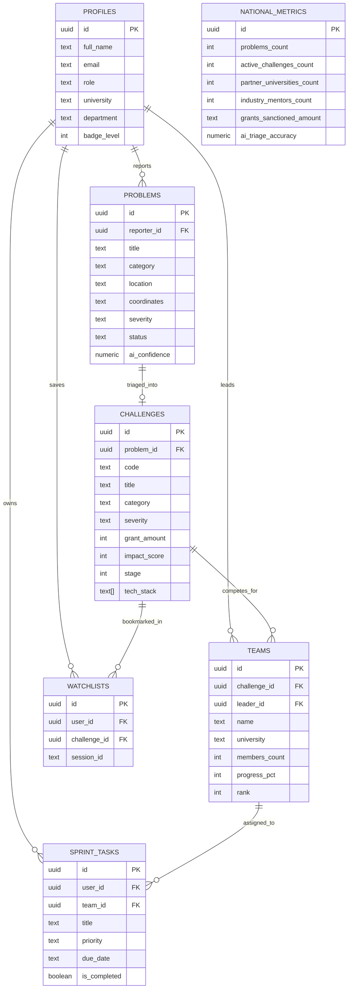

# CivicSolve AI 🇮🇳
### Autonomous Civic Distress Intelligence & Engineering Challenge Marketplace
**SIH26043 Civic Tech Initiative**

CivicSolve AI bridges the gap between raw citizen distress signals and actionable, university-led engineering solutions. By ingesting geo-tagged ground reports, triaging them using multi-modal AI, and packaging them into rigorous Problem Definition Statements, CivicSolve AI connects student lab squads with industry mentors and municipal grant funding.

---

## 🚀 Key Features & Modules

1. **5-Stage Autonomous Resolution Pipeline**
   - **Ground Report:** Multi-modal citizen intake (images, geo-coordinates, text description).
   - **AI Deep Analysis:** Automated clustering, deduplication, and danger index assessment.
   - **Problem Dossiers:** Formal problem specifications with baseline lab metrics (e.g., Turbidity, TDS, pH) and technical requirements.
   - **Lab Contenders & Mentorship:** Multi-disciplinary student teams claim challenges under corporate R&D guidance (e.g., Tata Steel R&D).
   - **Tangible Deployment:** Field prototypes and telemetry nodes deployed in pilot wards.

2. **6 Interactive Views & Workspaces**
   - **Overview / Landing (`#landing`):** Real-time national metrics, pipeline visualizer, and 5-stage lifecycle.
   - **Student Innovator Dashboard (`#dashboard`):** Personalized console for lead innovators (featuring Rahul Sharma, BIT Mesra), active sprints, milestone tracking, and task backlog.
   - **Challenges Marketplace (`#challenges-marketplace`):** Search and filter real-world challenges across Water, Waste, Healthcare, and AgriTech.
   - **Report a Problem (`#report`):** Citizen ground intake form with geo-coordinates and instant AI triage routing.
   - **AI Analysis Lab (`#ai-analysis`):** Multi-modal severity analyzer, vector similarity clustering, and confidence scoring.
   - **Challenge Dossier (`#challenge-dossier`):** Comprehensive technical dossier (e.g., Ranchi Water Quality #WT-09), hardware specs (LoRaWAN, ESP32, Spectrometry), contender squad registrations, and watchlist bookmarks.

---

## 🛠️ Technology Stack

| Layer | Technology / Tool | Description |
| :--- | :--- | :--- |
| **Frontend UI** | HTML5, Vanilla JavaScript (ES Modules) | Lightweight, performant single-page application (SPA) with hash-based client routing |
| **Styling & Design System** | Tailwind CSS, Custom Design Tokens | Curated modern palette, glassmorphism, responsive grid layouts, and micro-animations |
| **Icons & Typography** | Google Material Symbols, Google Fonts | Inter, Plus Jakarta Sans, Outfit typography |
| **Backend & Cloud Database** | [Supabase](https://supabase.com) (PostgreSQL 15+) | Managed Postgres backend with real-time API, Row-Level Security, and relational tables |
| **Client SDK** | `@supabase/supabase-js` (v2.116.0) | Singleton Supabase client handling queries, mutations, and optimistic local fallbacks |
| **Dev Server & Bundler** | [Vite](https://vitejs.dev/) (v8.3.0) | Lightning-fast local development server and HMR |

---

## 🗄️ Database Schema & Relational Architecture

CivicSolve AI uses a 7-table relational schema located in [`supabase/schema.sql`](supabase/schema.sql):



---

## 📁 Project Directory Structure

```
stitch_civicsolve_ai/
├── index.html              # Main single-page application & client router
├── package.json            # Project scripts and dependencies (@supabase/supabase-js, vite)
├── .env.local              # Supabase project URL and publishable key (gitignored)
├── .gitignore              # Ignores node_modules, .env.local, logs
├── README.md               # Project documentation and architecture guide
├── src/
│   └── lib/
│       └── supabaseClient.js # Singleton Supabase client instance
└── supabase/
    └── schema.sql          # Complete PostgreSQL DDL schema, RLS policies, & seed data
```

---

## ⚡ Getting Started Locally

### 1. Prerequisites
- [Node.js](https://nodejs.org/) (version 18 or higher recommended)
- npm or yarn

### 2. Installation
Clone or navigate to the repository directory and install dependencies:
```bash
npm install
```

### 3. Environment Configuration
Create a `.env.local` file in the root directory with your Supabase credentials:
```env
VITE_SUPABASE_URL=https://your-project-ref.supabase.co
VITE_SUPABASE_PUBLISHABLE_KEY=your_supabase_publishable_or_anon_key
```

### 4. Database Setup (Supabase)
1. Open your [Supabase Dashboard](https://supabase.com/dashboard).
2. Go to **SQL Editor** in the left navigation.
3. Copy the full contents of [`supabase/schema.sql`](supabase/schema.sql) and paste them into the query editor.
4. Click **Run** to generate all 7 tables, Row Level Security (RLS) policies, and seed records.

### 5. Run Development Server (Open on Any PC / Mobile)
Start the Vite development server exposed on all local network interfaces:
```bash
npm run dev
```
The terminal will display both your local and network URLs:
- **Local (Your PC):** `http://localhost:5173/`
- **Network (Any PC / Phone on Wi-Fi):** `http://192.168.X.X:5173/`

> [!TIP]
> Any other laptop, desktop, tablet, or smartphone connected to the same Wi-Fi or LAN can open the Network URL directly in any browser! You can also click **Any PC** in the bottom-right navigation bar for instant access instructions and link copying.

---

## 👥 Guest Access & Zero-Login Civic Reporting

CivicSolve AI provides a zero-friction citizen reporting experience:
- **Report Without Login:** Any citizen can directly register ground civic distress signals (water contamination, waste accumulation, public health) without creating an account or logging in.
- **Instant Guest Access:** One-click "Enter as Guest" mode in the Login card allows full exploration of marketplace challenges, AI triage lab, and project dossiers.
- **Optional Contact / Anonymous Reporting:** Citizens can report 100% anonymously or optionally enter their name/phone for SMS resolution updates.
- **Seamless Database Ingestion:** Public reports are ingested straight into Supabase with AI structuring and routed to student engineering labs.

## 🔐 Authentication & Database Synchronization (Firebase + Supabase)

CivicSolve AI features a hybrid architecture combining **Firebase Authentication** (for Google One-Tap/Popup and automated Email Verification links) with **Supabase PostgreSQL** (for relational persistence and Row Level Security).

### 🌟 Key Capabilities
- **Google OAuth Sign-In**: Instant one-click Google account verification.
- **Email Verification**: When users register with Email & Password, an email verification link is automatically dispatched via Firebase Auth (`sendEmailVerification`).
- **Realtime Database Synchronization**: On every sign-in or sign-up (Google or Email), the user's profile is automatically upserted into the Supabase `public.profiles` table with email verification status, avatar, full name, and university affiliation.
- **Forgot Password**: One-click password reset email recovery.

---

### Step 1: Firebase Project Setup
1. Go to the [Firebase Console](https://console.firebase.google.com/).
2. Create or open your Firebase project (e.g., `civicsolve-ai`).
3. Under **Build** → **Authentication** → **Sign-in method**:
   - Enable **Google** (Select support email and save).
   - Enable **Email/Password** (Enable *Email/Password* provider and ensure *Email link (passwordless sign-in)* is optional or left off).
4. Under **Project Settings** → **General** → **Your Apps**:
   - Add a **Web App** (`</>`).
   - Copy the `firebaseConfig` keys into `.env.local`:
     ```env
     VITE_FIREBASE_API_KEY=AIzaSy...
     VITE_FIREBASE_AUTH_DOMAIN=civicsolve-ai.firebaseapp.com
     VITE_FIREBASE_PROJECT_ID=civicsolve-ai
     VITE_FIREBASE_STORAGE_BUCKET=civicsolve-ai.appspot.com
     VITE_FIREBASE_MESSAGING_SENDER_ID=1234567890
     VITE_FIREBASE_APP_ID=1:1234567890:web:...
     ```

---

### Step 2: Supabase Database Synchronization
1. Open the [Supabase SQL Editor](https://supabase.com/dashboard/project/bgfhmxwpsihkqjhgrjbj/sql).
2. Execute [`supabase/schema.sql`](supabase/schema.sql) to configure the `profiles`, `problems`, `challenges`, `teams`, `sprint_tasks`, `watchlists`, and `national_metrics` tables.
3. Every authenticated user is automatically synced into `profiles`:
   ```sql
   SELECT id, full_name, email, provider, verified, email_verified, university FROM public.profiles;
   ```

---

### Step 3: Test Verification & Login Flow
1. Open `http://localhost:5173/#login`.
2. **Google Sign-In**: Click **Continue with Google** to sign in with your verified Google account.
3. **Email Sign-Up**: Switch to **Create Account**, fill in details, and click **Create Innovator Account**.
   - An email verification link is immediately sent.
   - The user profile is created in Supabase with `email_verified: false`.
4. Once verified, logging in updates `verified: true` and activates full platform privileges.

---

## 🔒 Security & Best Practices

- **Row Level Security (RLS):** All 7 tables have RLS enabled with granular read, insert, update, and delete policies for public and authenticated access.
- **Environment Isolation:** Secrets and keys are strictly managed through environment variables (`.env.local`) and Vite's `import.meta.env` loader.
- **Resilient Fallback:** The frontend incorporates in-memory caching and optimistic UI updates, ensuring smooth interaction even during network interruptions.

---

## 📄 License
Developed for **Smart India Hackathon (SIH 2024–2025)** under the Civic Technology & Smart Governance initiative.
